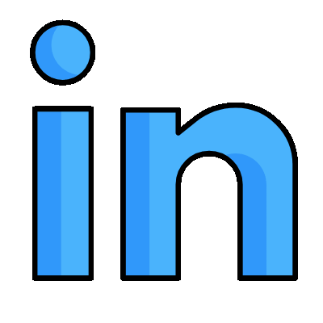
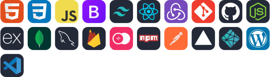

  

</a>

<h3 align="center">I’m a Web Developer passionate about creating dynamic and user-friendly web experiences.</h3>

<!-- line -->

- 👀 I’m interested in **Full Stack Development**

- 🌱 I’m currently learning **Reactjs, Nodejs, Mongodb and NextJs**

- 👨‍💻 All of my projects are available [here](https://portfolio-Happy-Samal.vercel.app/)

- 📫 How to reach me **rudrasamal007@gmail.com**

 

<!-- line -->

<h2 align="left"> 💬 <b>Connect with me:</b></h2>

  

&nbsp; &nbsp;

&nbsp; &nbsp;

<h2 align="left"><b>🎇Languages and Tools</b></h2>

   

 

 
<!-- line -->

 

 

